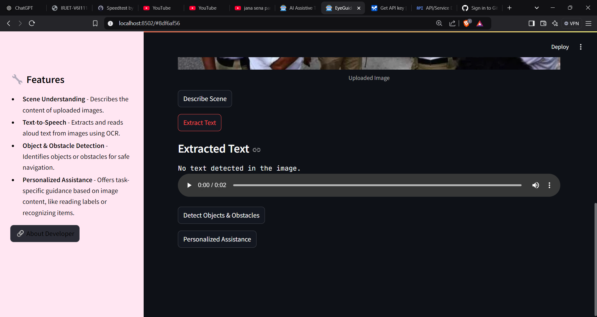
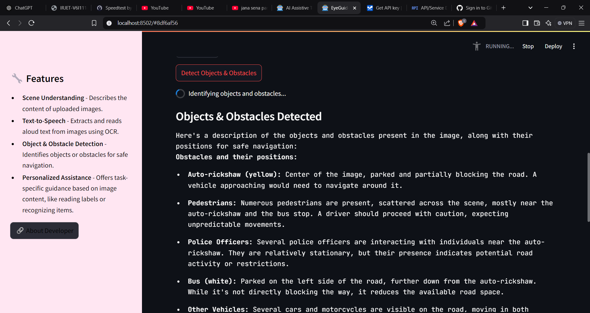
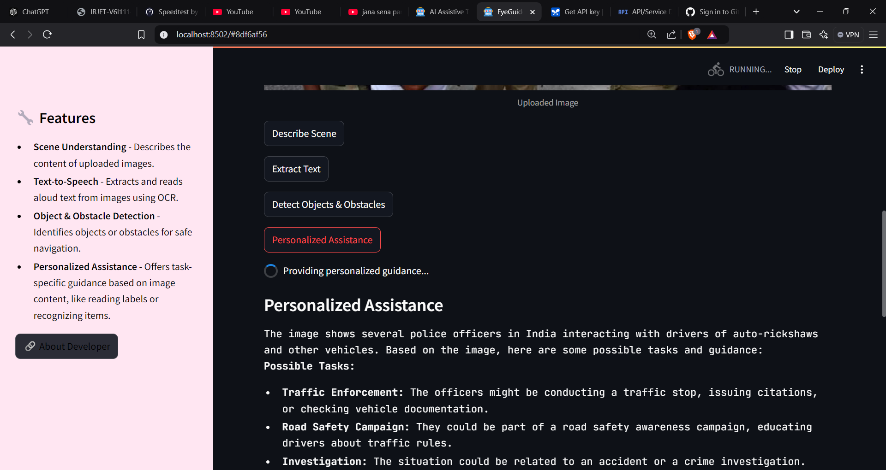

# EyeGuide AI 💻👁️ - An AI Assistive Tool for the Visually Impaired

## Project Overview
EyeGuide AI is a cutting-edge tool designed to assist visually impaired individuals by providing them with real-time visual and contextual understanding. Using advanced image processing, OCR, and natural language processing techniques, EyeGuide AI can describe scenes, extract text from images, detect obstacles and objects, and provide personalized assistance based on the content of the image.

## Features
- **Scene Understanding**  
  Get a description of the visual scene to assist with navigation and awareness of surroundings.  
  

- **Text-to-Speech**  
  Automatically reads out extracted text or descriptions to provide auditory feedback.  
  

- **Object & Obstacle Detection**  
  Identifies obstacles and objects in images and highlights their positions for safe navigation.  
  

- **Personalized Assistance**  
  Offers task-specific guidance based on the content of the image, including item recognition and label reading.  
  

## Technology Stack
- **Image Processing**: The tool uses **Tesseract OCR** for text extraction from images.
- **Generative AI**: Powered by **Google Gemini** model for scene analysis and description generation.
- **Text-to-Speech**: Utilizes **gTTS** (Google Text-to-Speech) to convert text into speech for easy understanding.
- **User Interface**: Built using **Streamlit**, a simple web app framework for Python.

## Installation & Usage
1. Clone the repository to your local machine:
    ```bash
    git clone https://github.com/YaminiRajaRao/Eyeguideai.git
    ```

2. Install the required Python packages:
    ```bash
    pip install -r requirements.txt
    ```

3. Run the Streamlit app:
    ```bash
    streamlit run app.py
    ```

4. Open your browser and navigate to the Streamlit interface to upload images and interact with the AI tool.

## About the Developer
- **Name**: Yamini Jampala  
- **GitHub**: [github.com/YaminiRajaRao](https://github.com/YaminiRajaRao)  
- **LinkedIn**: [linkedin.com/in/yamini-j9010](https://www.linkedin.com/in/yamini-j9010)   


